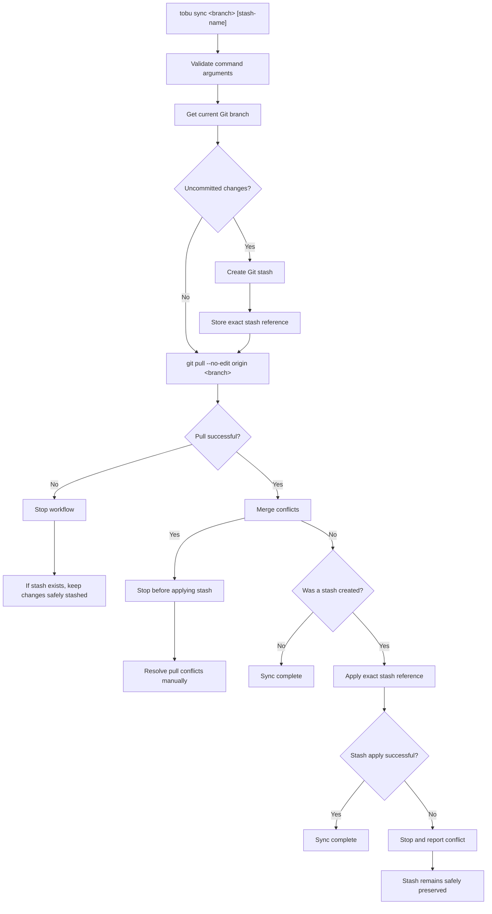

# Tobu

**Tobu** is a personal developer CLI built in Java to automate repetitive Git workflows and developer tasks.

The goal of Tobu is to simplify common development workflows that are performed repeatedly while working on projects with Git, particularly workflows involving feature branches, keeping local changes safe, and synchronizing with the latest changes from a shared development branch.

---

## 🚀 Current Version

**Tobu CLI v1.0.0**

## ✨ Current Commands

| Command   | Description                                                                                   |
| --------- | --------------------------------------------------------------------------------------------- |
| `info`    | Displays Tobu usage information and available commands                                        |
| `version` | Displays the current Tobu CLI version                                                         |
| `sync`    | Stashes local changes, pulls the latest changes from a remote branch, and reapplies the stash |

---

# ✨ `tobu sync`

The primary command in Tobu v1.0.0 is:

```bash
tobu sync <branch> [stash-name]
```

The command synchronizes the current Git branch with a branch from the remote `origin`.

For example:

```bash
tobu sync dev
```

or with a custom stash name:

```bash
tobu sync dev "Payment API work"
```

If no stash name is provided, Tobu uses the default stash name:

```text
tobu: auto-stash before sync
```

---

## 💡 Why `tobu sync`?

A common development workflow looks like this:

1. Work on a feature branch.
2. Make local changes.
3. Another developer merges changes into `dev`.
4. You need to bring the latest `dev` changes into your current branch.
5. Your local changes need to be temporarily stashed.
6. Pull the latest changes from `origin/dev`.
7. Reapply your local changes.
8. Continue development.

Normally, this involves multiple Git commands and manual handling of merge conflicts.

Tobu automates this workflow into:

```bash
tobu sync dev
```

---

# 🔄 Sync Workflow

The overall workflow is:



---

# 🛡️ Error and Conflict Handling

Tobu is designed to avoid losing local work.

## 1. Stash creation fails

If Tobu cannot create the stash:

```text
Stop workflow
↓
Do not pull
↓
Report error
```

The pull operation is not attempted because the user's local changes have not been safely stored.

---

## 2. Git pull fails

If the pull operation fails:

```text
Stop workflow
↓
Do not apply stash
```

If a stash was created, it remains safely stored in Git.

---

## 3. Pull results in merge conflicts

If pulling the latest changes results in merge conflicts:

```text
Stop workflow
↓
Do not apply stash
↓
User resolves pull conflicts manually
```

The user's stash remains untouched.

This prevents two separate sets of conflicts from being introduced simultaneously.

---

## 4. Stash apply results in merge conflicts

If the pull succeeds but applying the user's local changes creates conflicts:

```text
Stop workflow
↓
Report conflicted files
↓
User resolves conflicts manually
```

The stash is **not removed** because Tobu uses:

```bash
git stash apply
```

instead of:

```bash
git stash pop
```

This means the original stash remains available as a safety net.

---

# 🏗️ Project Architecture

Tobu follows a separation-of-responsibilities approach.

The primary components include:

```text
com.keno.tobu
│
├── command
│   ├── InfoCommand
│   ├── SyncCommand
│   └── VersionCommand
│
├── service
│   ├── GitService
│   └── SyncService
│
├── validation
│   └── CommandValidator
│
├── logger
│   ├── ConsoleLogger
│   └── ConsoleColor
│
└── constant
    └── TobuConstants
```

The exact package structure may evolve as new commands and capabilities are introduced.

### Responsibilities

**Tobu**

Entry point for the CLI and command routing.

**Command**

Handles command-level execution and interaction with the user-facing CLI layer.

**InfoCommand**

Displays Tobu's usage information, available commands, and example invocations. It serves as the CLI's help and information screen.

**CommandValidator**

Centralized validation of commands and their arguments. When invalid input is detected, the validator reports the appropriate error and the CLI displays the available usage information through `InfoCommand`.

**GitService**

Responsible for interacting with Git and executing Git-related operations.

**SyncService**

Responsible for the business workflow of synchronizing the current branch with a remote branch.

**ConsoleLogger**

Provides consistent console output, formatting, and colors.

**ConsoleColor**

Defines supported console colors and formatting.

**TobuConstants**

Central location for application constants such as command names, default stash names, and version information.

---

# ☕ Java Requirements

Tobu is currently built using:

* **Java 17**
* **Maven**
* **Git**

The application is compiled for Java 17.

You can verify your Java installation with:

```bash
java -version
```

and Maven with:

```bash
mvn -v
```

---

# 🔨 Building Tobu

Clone the repository:

```bash
git clone <repository-url>
```

Navigate to the project:

```bash
cd tobu
```

Build the project:

```bash
mvn clean package -DskipTests
```

The resulting JAR is generated inside:

```text
target/
```

---

# ▶️ Running Tobu

The JAR can be executed directly using Java 17 or newer:

```bash
java -jar target/tobu.jar version
```

To run the sync command:

```bash
java -jar target/tobu.jar sync dev
```

With a custom stash name:

```bash
java -jar target/tobu.jar sync dev "Payment API work"
```

> The exact JAR name may depend on the current Maven configuration.

---

# 🖥️ Cross-Machine Launcher

Tobu is intended to be used on multiple development machines.

The current development environments may have different default Java configurations. For example:

```text
Work Laptop
    │
    ├── Default java → Java 8
    └── Java 17 installed separately
```

and:

```text
Personal Laptop
    │
    └── Default java → Java 21
```

To avoid modifying system Java configuration, Tobu includes a PowerShell launcher:

```text
scripts/
└── tobu.ps1
```

The launcher searches for a suitable Java installation and uses Java 17 or newer to execute the Tobu JAR.

The launcher does **not**:

* Modify `PATH`
* Modify `JAVA_HOME`
* Modify Windows Registry settings
* Install Java
* Download software
* Require administrator privileges
* Modify system configuration

Run Tobu using:

```powershell
.\scripts\tobu.ps1 version
```

or:

```powershell
.\scripts\tobu.ps1 sync dev
```

with a custom stash name:

```powershell
.\scripts\tobu.ps1 sync dev "Payment API work"
```

This allows the same Tobu project to be used across different development environments without manually specifying the Java executable path each time.

# ⚠️ Invalid Command Handling

Tobu validates commands and their arguments before executing them.

When an invalid command or invalid arguments are provided, Tobu:

1. Validates the command and arguments.
2. Logs the validation error using `ConsoleLogger`.
3. Executes `InfoCommand` to display the available commands and correct usage.

This provides the user with both the reason the command failed and the information required to use Tobu correctly.

For example, an invalid command may result in:

```text
[ERROR] Unknown command: abc

[INFO] Tobu - Personal Developer CLI

Usage:
  tobu <command> [arguments]

Commands:
  sync      Sync current branch with another branch
  version   Display Tobu version

Examples:
  tobu sync dev
  tobu sync dev "Payment API work"

  tobu version
```

This approach keeps the CLI's usage information centralized in `InfoCommand` rather than duplicating help text across different parts of the application.


---

# 📋 Command Reference

## Version

```bash
tobu version
```

Displays the current Tobu CLI version.

Example:

```text
[INFO] Tobu CLI v1.0.0
```

---

## Info

```bash
tobu info
```

Displays the available Tobu commands, their usage, and examples.

Example output:

```text
[INFO] Tobu - Personal Developer CLI

Usage:
  tobu <command> [arguments]

Commands:
  sync      Sync current branch with another branch
  version   Display Tobu version

Examples:
  tobu sync dev
  tobu sync dev "Payment API work"

  tobu version
```

The `InfoCommand` replaces the previous `printHelp()` implementation and provides a dedicated command for accessing Tobu's usage information.

---

## Sync

```bash
tobu sync <branch>
```

Synchronizes the current branch with the latest changes from:

```text
origin/<branch>
```

Example:

```bash
tobu sync dev
```

---

## Sync with Custom Stash Name

```bash
tobu sync <branch> "<stash-name>"
```

Example:

```bash
tobu sync dev "Payment API work"
```

The custom stash name is preserved in Git and the stash remains available after `git stash apply`.

---

# 🧪 Development Status

## Prototype #1 — Completed

The first Tobu prototype establishes the foundation of the CLI.

### Completed

* [x] Java CLI application
* [x] Maven project
* [x] Java 17 compilation
* [x] Command routing
* [x] Command validation
* [x] `sync` command
* [x] `version` command
* [x] Optional stash name
* [x] Automatic Git stash handling
* [x] Exact stash reference tracking
* [x] `git pull --no-edit origin <branch>`
* [x] Pull failure handling
* [x] Pull merge conflict handling
* [x] Stash apply conflict handling
* [x] Stash preservation using `git stash apply`
* [x] Git service abstraction
* [x] Separation of sync responsibilities
* [x] Console logger
* [x] Colored console output
* [x] Console color enum
* [x] Centralized constants
* [x] Cross-machine Java detection
* [x] Non-invasive PowerShell launcher

---

# 🗺️ Future Roadmap

Tobu is intended to grow into a personal developer productivity CLI.

Potential future commands and capabilities include:

```text
tobu status
tobu doctor
tobu clean
tobu branch
tobu pr
tobu release
```

The exact commands and functionality will be designed as the project evolves.

The goal is to automate repetitive developer workflows while keeping Tobu simple, transparent, and safe.

---

# 📄 License

This project is currently a personal developer tool and is not intended for public distribution.
